# YMDK 75% SP84 Split Keyboard Build Log

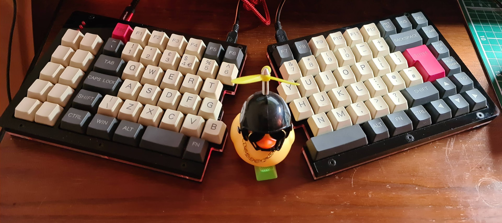
Final build with YMDK keycaps (rubber ducky unrelated).

# Introduction
I decided to level up my Mechanical Keyboard skills by building my first kit.

When it comes to Mechanical Keyboards, I know what I like
* ISO UK over ANSI
* MX Browns or MX Clears

I've wanted a split keyboard for a while, but the need for an ISO UK layout put
me off a pure Ergonomic build. It's also very hard to find a custom split that 
isn't just ANSI.

The YMDK 75% Split Keyboard is similar to the V.EA layout. All images I found
on-line where ANSI layout but the specs state it can do ISO. It's also quite
in-expensive (as mechanical keyboards go), so I decided to give it a try.

Unfortunately, I didn't find any build instructions for the kit on-line and 
assumed they would come with the kit. I assumed incorrectly. Any one else
planning to build this kit, especially for ISO layout, may find this useful.

## Update: 2020-09-30
The Tai Hao ABS key caps, although very nice, didn't quite map to the keyboard 
layout, and the custom keys I received from WASD keyboards didn't blend well 
enough.

Then I found that I could buy the YMDK 96 84 key caps in Grey/Beige for ISO/ANSI
layout from Amazon UK. This set wasn't fully ISO UK, but I found the additional 
ISO keys for the YMDK set could be bought to make it a full ISO UK layout.

These key caps aren't as nice or as high quality as the Tao Hao ABS Doubleshot 
key cap set I originally bought, but they fit the layout perfectly and I am very 
happy with them.

## Update: 2020-11-09
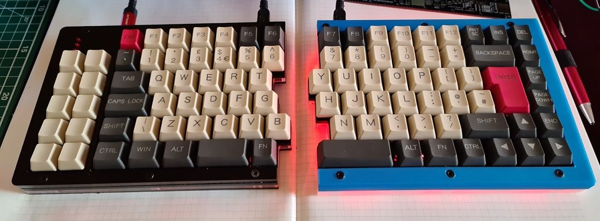

The under-glow is, well, underwhelming. So I am starting down the road of designing 
and printing my own case(s). My design replaces the top and bottom acrylic layer 
with a 3D printed top and bottom case, which then enclose the middle acrylic layers. 

So far, I've only completed the right side of the keyboard, but in comparison the
white, slightly translucent PLA material for the bottom half of the case vastly 
improves the under-glow. 

The image above was taken in daylight. The under-glow on the left side is barely
visible, whereas on the right it is quite bright.

I've only completed the right side. Once I have modelled and printed both sides,
I will add the 3D model STL files to this repo.

## Parts

| Parts                                         | Cost    | Source                    |
|:---------------------------------------------:|:-------:|:-------------------------:|
| Split 75% SP84 DIY Kit (MX Browns)            | £91.01  | AliExpress - YMDK Store   |
| YMDK 96 84 ANSI ISO Keycap set (grey/beige)   | £19.83  | Amazon UK                 |
| YMDK UK ISO Additional Keys Set (beige)       | £10.45  | Amazon UK                 |

Some prices are converted from USD to GBP, and only accurate to the time of 
purchase.

### Split 75% SP84 DIY Kit

[Split 75% SP84 Acrylic Case Plate Underglow Fully Programmable PCB Stabilizers
ANSI ISO DIY Kit](https://www.aliexpress.com/i/33006060286.html) similar to VEA layout.
* There are several purchase options from bare PCB to fully assembled kit, with
a variety of switch options available too.
* I went with option 3 - Kit + 97 Cherry MX Brown switches + MX Stabilizers.
* You also need to buy 3 LED to go with the kit. I had some already, so
didn't bother.
* The kit doesn't include key caps but you can buy an YMDK key cap set for ANSI
and ISO, and a separate YMDK set for European ISO keys, including UK ISO.

Originally:
* [Tai Hao ABS Double Shot OEM Keycaps](https://www.aliexpress.com/item/32817770213.html) and [ISO Modifier Keycap kit](https://www.aliexpress.com/i/32962248699.html)
* Fortunately, YMDK sell the [extra keys for the SP84](https://www.aliexpress.com/item/4000873836738.html?spm=a2g0s.9042311.0.0.1a954c4d8baSSx) as a kit. Although they are only PBT, they are blank.
* The biggest issue I discovered is the right shift for ISO layout which is an R1 1x1.75 key.  
* I ended up buying the right shift and a couple of R1 1x1 keys for the bottom row from WASD. The postage was as expensive as the keys!

Updated 2020-09-30
* [YMDK 96 84 ANSI ISO Keycap set (gray/biege)](https://www.amazon.co.uk/gp/product/B079GZQFY6/ref=ppx_yo_dt_b_asin_title_o00_s00?ie=UTF8&psc=1) 
ISO layout but not quite ISO UK.
* [YMDK UK ISO Additional Keys Set (biege)](https://www.amazon.co.uk/gp/product/B086PDFN9S/ref=ppx_yo_dt_b_asin_title_o00_s00?ie=UTF8&psc=1) 
  for the missing ISO UK keys 

# Build Log

## YMDK 75% SP84 Keyboard kit.
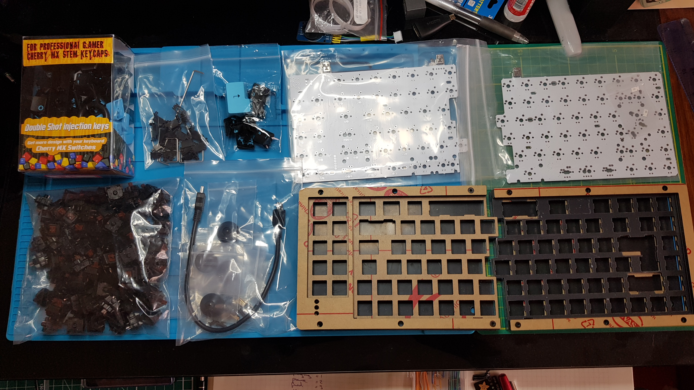

The kit came in a plain box and was well protected with bubble wrap. The kit
contained:
* Two PCB boards (left and right hand side)
* The acrylic case parts, there are 6-layers to each side, with one being a 
clear acrylic layer for the under-glow.
* Fixings for the case consisting of
    * M3 10mm Countersunk hex bolts x 20 (should be 24)
    * 10mm brass standoffs female x 10 (should be 12)
* A bag of MX Stabilisers, enough for 5 stabilisers including the space-bar!
* 4 feet and bolts for feet
* USB-Standard-A to USB-Mini-B cable to connect the PC to the keyboard.
* USB-Mini-B to USB-Mini-B to connect the two keyboard halves.
* 96 x Cherry MX Brown switches.

Note: 
* The kit was missing 4-bolts and 2-standoffs for the case, but 
2-days after delivery they came in the post in a little box. 
* The kit doesn't include indicator LED, 3 are needed, I already had some but 
the YMDK shop has links to appropriate LED.
* The kit comes with 96 switches, which is the exact amount needed for the ISO 
layout.

## Testing the PCB

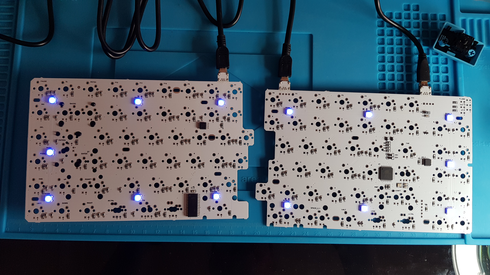

Before starting I connected the PCB using the USB cables, you can see the 
under-glow LEDs are working.

## Right Side Stabilisers
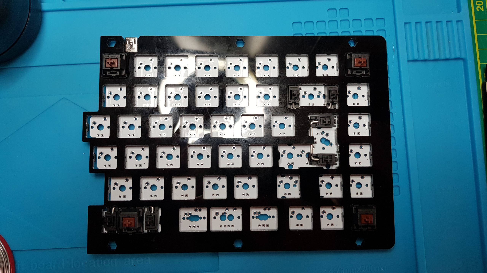

Here you can see the Right side part of the keyboard with the Backspace, Return
and right side split Space-bar stabilisers. These are standard MX stabs.

* You have to fit the stabilisers before soldering any of the switches because the 
switches fit to the plate and hold the PCB in place.
* Three are needed, all the same size, even for the left side split space-bar key.
* The space-bar key stabiliser has to be fitted 'upside down' because it is at the
edge of the PCB and there isn't a full whole for the stabiliser leg. 
* I should have taken a picture before adding the base plate and four corner switches. I did for the left side though, so go see that.
* The right side shift is 1.75u, even for the ANSI layout. Let me tell you, that is a bugger to find a key cap for! 
(Updated 2020-09-30: Unless you buy the YMDK key cap set).

## Left Side Stabilisers

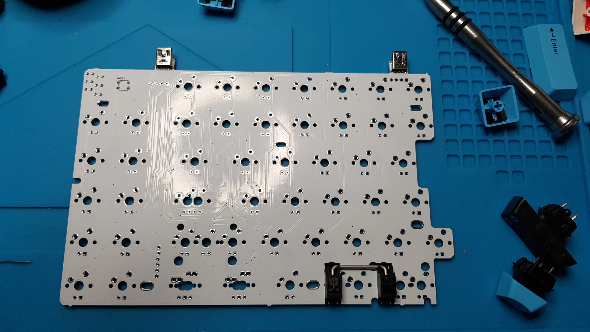

I remembered to take the picture BEFORE fitting the plate and corner switches.
You can more clearly see the space-bar stabiliser is fitted upside down because it
is on the edge of the PCB. You can see, staggered to the right, two half-hole/notches, if you wanted the split further right. 

Because this is an ISO layout, no other stabilisers are necessary. 

## Left Side ISO keys
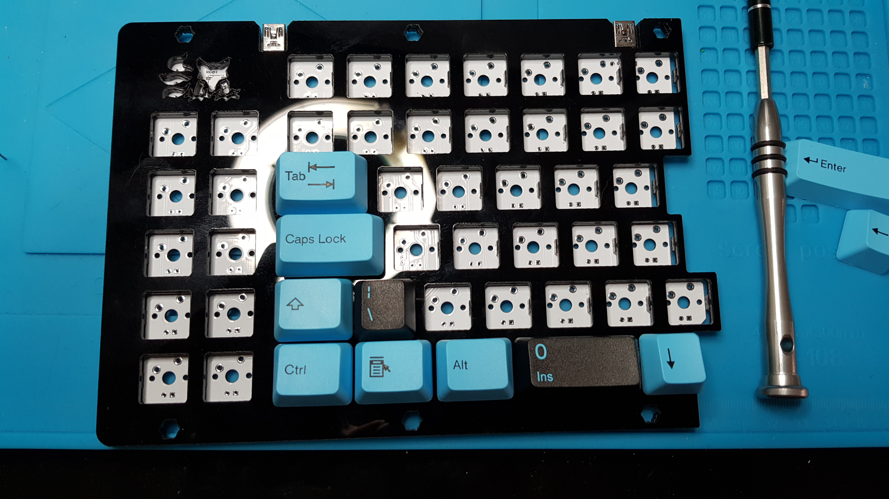

Before soldering anything, I laid out the switches with the ISO keys to get 
the correct positions. 

As you can see the [0 Ins] key from the number-pad is the correct size for the
left size space key. I will replace it later when I get the keys from YMDK.

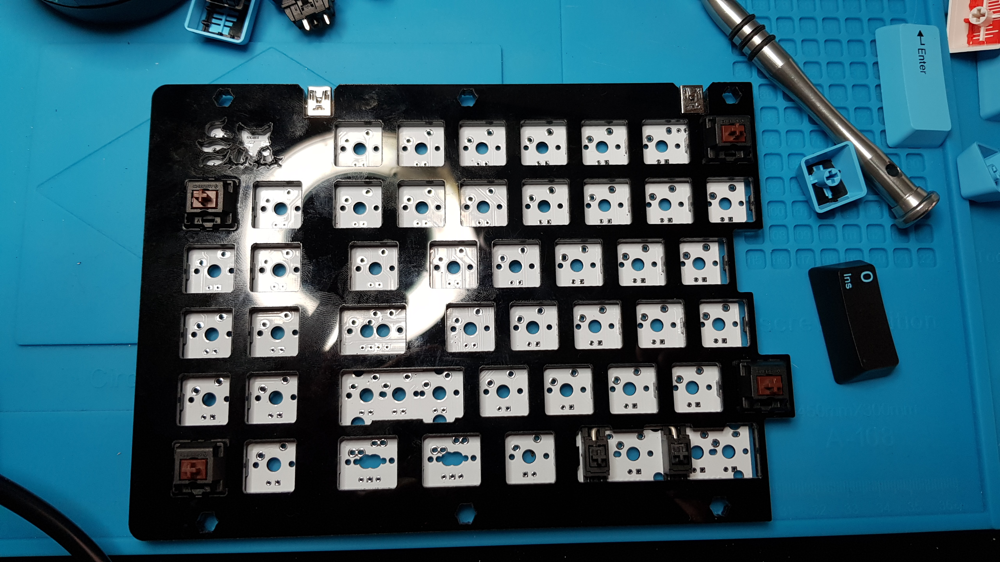

As with the right side, two layers of acrylic make up the switch plate. The
switches fit tightly and click into each switch hole. Then, when soldered to
the PCB , the switched hold the plate to the PCB. There are no mounting screws
or holes in the PCB for this otherwise.

Following other guides, I soldered the corner switches first and then filled it
in. 

You can probably already see that the acrylic is a finger-print magnet.

## Fully Soldered and Naked

Here are the left and right side fully soldered and naked (without key caps), so
that you can clearly see the switch placement for the ISO layout. 

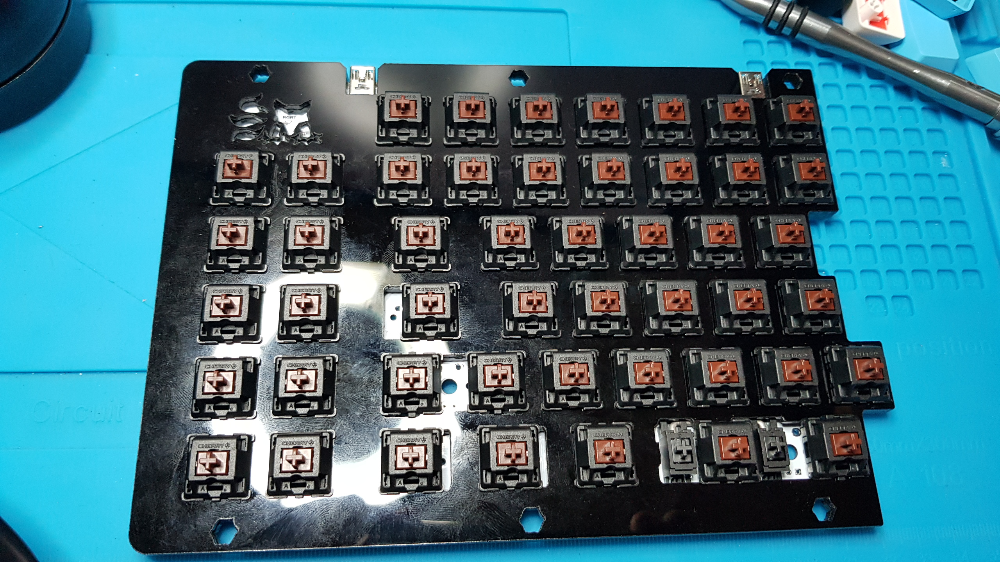

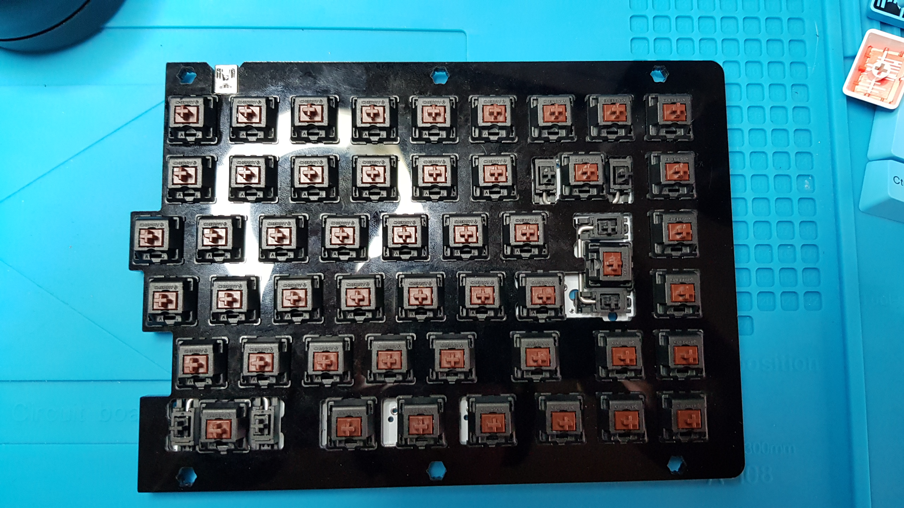

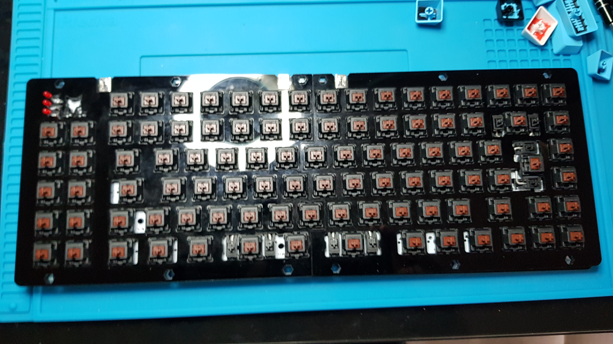

## Fully Assembled

Here it is with all key caps in position. You can see that I have used some of
the num-pad keys on the bottom row for the split space-bar and R1 keys.

~~I'll add updates once the YMDK spare key kit comes.~~ In the end, I bought
the YMDK key cap set for this keyboard (see top picture).

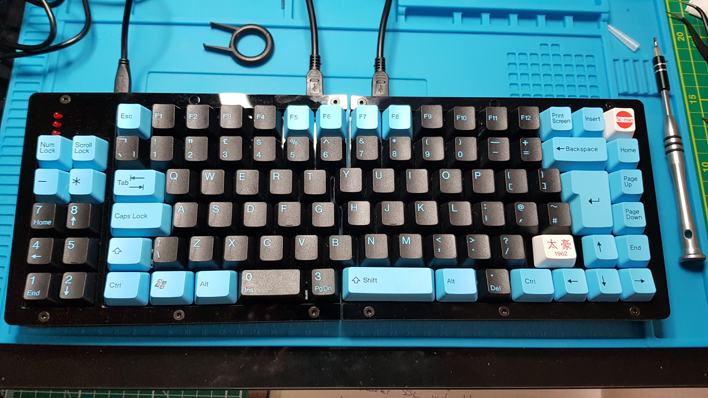

## Keyboard Layout 

Because, I've bastardized some of the keypad keys and because the documentation
is lacking, here are some layout diagrams for the YMDK 75% SP84 in ISO configuration.

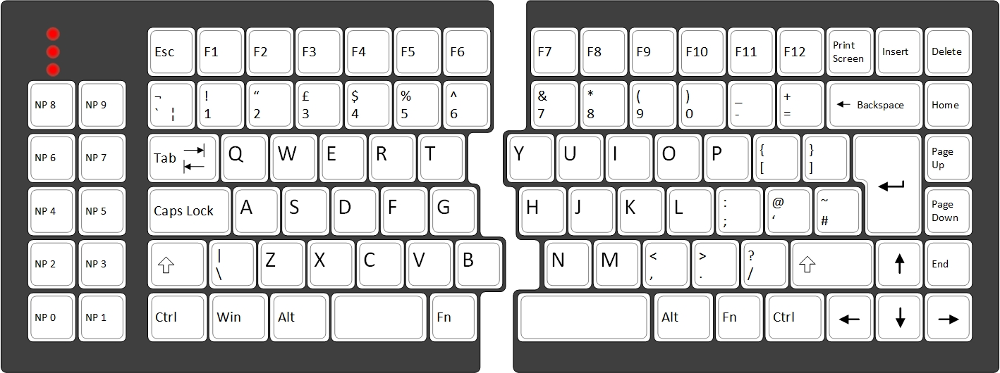
Note that the extra keys on the left side are actually mapped to what would be
the numberpad on a full size keyboard. The numlock will change their function
but the standard keyboard software configuration doesn't map a numlock key.

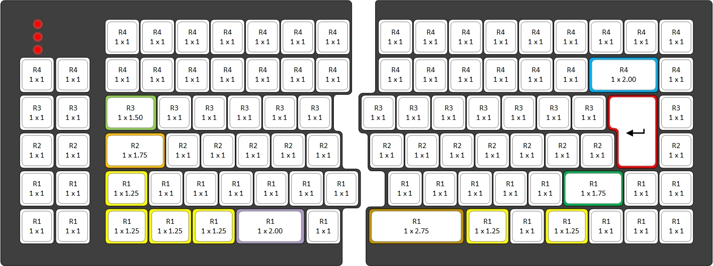
This is the same diagram but with the OEM key cap sizes. As previously stated 
that R1 1 x 1.75u Right Shift key is the hard one to source.

# Programming the Keyboard
I used the [Bootmapper Client](https://www.dropbox.com/s/3bn9flirkb49ahz/BootmapperClient.zip?dl=0)
application (downloaded from DropBox).

The software is little unpolished but serviceable.

I found two really good guides, linked below
* Drop - [Programming KBD Keyboards via Bootmapper Client](https://drop.com/talk/1392/programming-kbd-keyboards-via-bootmapper-client-tmk-guide-getting-added-soon-here)
* MecKey Alpha - [Guide on Bootmapper client](https://meckeyalpha.com/pages/guide-on-bootmapper-client)

# Conclusions

Overall, I am very happy with this keyboard and I am using it as my daily driver.
The cons listed below are minor, in my opinion. 

## Pros

* The kit was relatively inexpensive.
* It was a fun build for me, as the first keyboard I've built.
* I love the layout and using the split is very comfortable.
* Surprisingly, the multi-layered cut acrylic makes for a very solid, weighty 
keyboard.

## Cons
* Kit came with everything except key caps and three LEDs, but I feel that it could
have included the LEDs. 
* The acrylic is an absolute finger-print magnet.
* ~~YMDK sell key-cap sets (2 different colour schemes) for this, but not ISO~~.
* ~~The under-glow is very dim and can't be seen in normal lighting conditions.~~

## Update 2020-09-30: 

As you can see, some of the Cons turned out to be simple to resolve.
* The under-glow is configurable using the Bootmapper Client software, but by 
default is very dim.
* YMDK key caps for ISO and ANSI are available on Amazon UK, but it's not a full 
ISO UK set. There are additional YMDK ISO keys for the key caps that achieve a 
full ISO UK layout and I am very happy with that.

## Update 2020-11-09:

3D printing a case with a white translucent bottom half seems to significantly 
improve the underglow.
