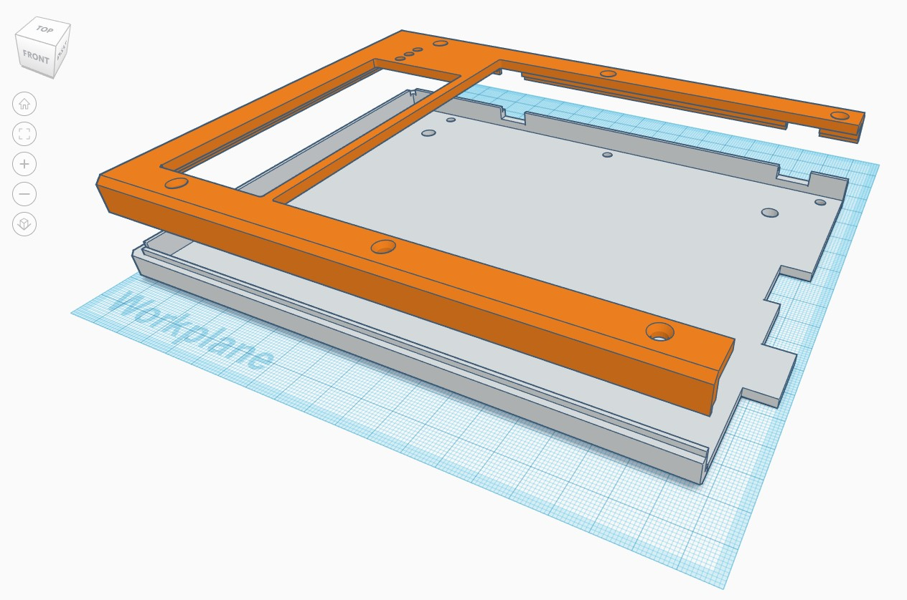
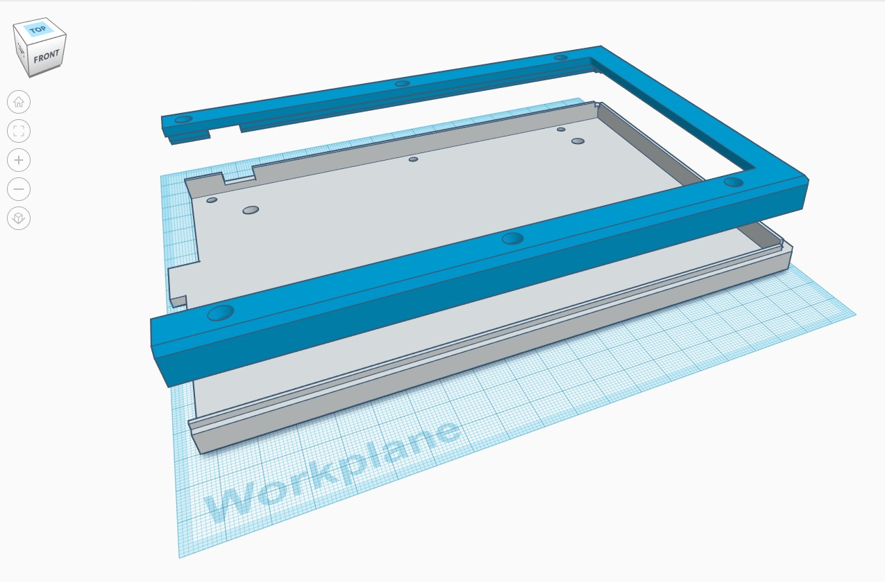

# YMDK 75% SP84 Split Keyboard 3D Case Models

I used [TinkerCad](https://www.tinkercad.com) to design the case and wrist rest models, 
for a free, on-line 3D modeling tool it's basic but it gets the job done.

I have a Prusa MK3S Printer, and used the PrusaSlicer software to slice the models
for printing. 

### UPDATE: 2021-07-28
Added .SVG files for the keyboard case tops and bottoms.

## Print Settings

For printing, I used the basic default settings.

| Setting                           | Value                   |
|-----------------------------------|-------------------------|
| Print Setting                     | 0.15mm QUALITY MK3      |
| Filament                          | Prusa PLA               |
| Printer                           | Original Prusa i3 MK3s  |
| Supports                          | None                    |
| Infil                             | 15%                     |

## Sliced Info

| Model                                    | Print Time | Filament (g) | Filament (m) |
|:----------------------------------------:|:----------:|:------------:|:------------:|
| Wrist-Rest-bottom.stl                    | 3h 59m 17s | 43.05        | 14.43        |
| Wrist-Rest-foot.stl                      | 41m 52s    | 6.10         | 2.05         |
| Wrist-Rest-top.stl                       | 1h 22m 44s | 18.37        | 6.16         |
| YMDK-SP84-left-bottom.stl                | 6h 14m 41s | 79.59        | 26.69        |
| YMDK-SP84-left-top.stl                   | 3h 17m 8s  | 29.73        | 9.97         |
| YMDK-SP84-right-bottom.stl               | 6h 15m 48s | 80.13        | 26.87        |
| YMDK-SP84-right-top.stl                  | 3h 1m 26s  | 26.55        | 8.90         |

Don't forget to double up when printing the wrist wrest parts!
